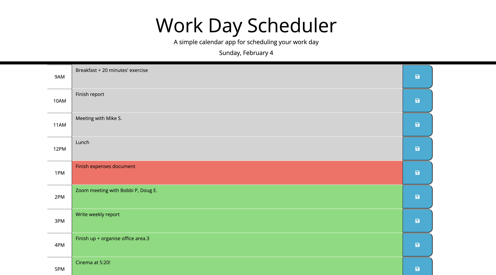

# Work Day Scheduler (Module 7 Challenge)
My submission for the Module 7 Work Day Scheduler Challenge

## Description

This is my submission for the Module 7 Work Day Scheduler challenge. The challenge was to create a functional work-day planner using JavaScript and additional libraries for the logic, in addition to Bootstrap, HTML and CSS for layout and styling. The app was styled to closely match the example image provided by the instructional team.

## Installation

No installation is necessary. The project should be viewed within the browser by following the link below.

## Usage

The webpage can be accessed via the following url: https://jonathon10k.github.io/Work-Day-Scheduler

## Credits

N/A

## License

N/A
